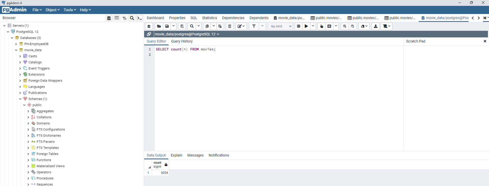
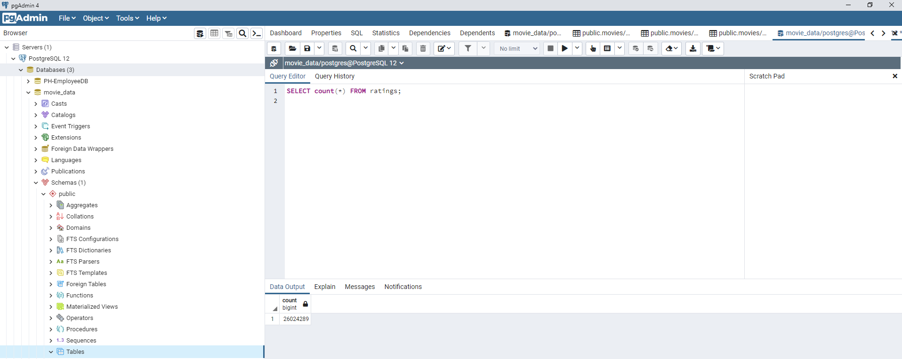

# Movies ETL

## Objective

To execute and Extract, Transform and Load process in which we clean datasets and create new ones, by editing JSON and CSV files while using Pandas and Postgres.

## Process

1. We created a function that reads three separate files, two CSV and one JSON. After reading the files, we created three dataframes with the corresponding information
2. In the JSON file, we cleaned the information by employing list comprehesions, try-except blocks, eliminating columns with null values and using lamba and join functions. In this process we created a funcion to execute this process. As a result, we obtained a clean dataframe with movies data from Wikipedia.
3. In one of the csv files, we cleaned the information by employing list comprehensions, try-except blocks, eliminating columns with null values and using lamba and join functions. In the process we refactored the code developed in stage 2, afterwards we merged the clean dataframe from stage 2 and the one from this stage, we also filled the missing information and renamed columns. 
4. We created a connection to the PostgreSQL database and added the clean dataframes from the previous stages to SQL databases. Below you will find pgAdmin outputs showing the number of rows per uploaded database.

